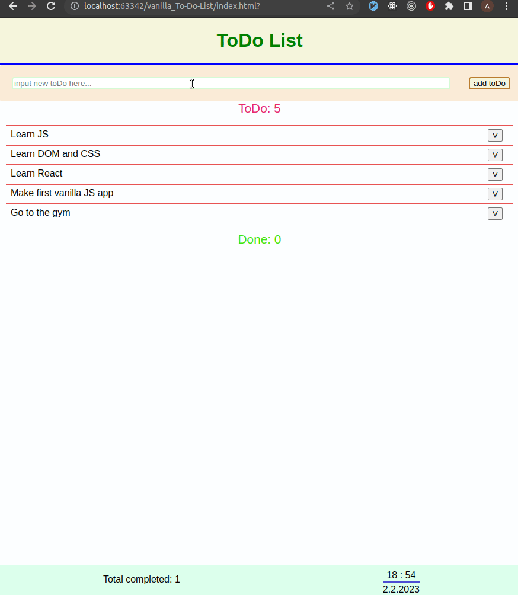

## vanilla_js_toDoList
Simple vanilla JavaScript project to learn the **basic** concepts of frontend development.

[Click to check the demo](https://antonkurenov.github.io/vanilla_js_toDoList/ "To-Do List")

Key features:

- your system date and time in fixed footer.
- all data saved to localStorage, so you won't lose data when you close your browser.
- app protected from empty input.
- counter that counts all completed tasks.
- top notch design :-)

Check this out :point_down:

